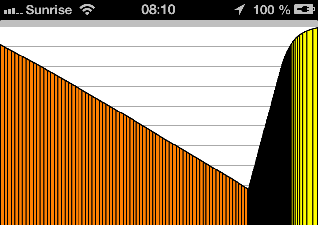
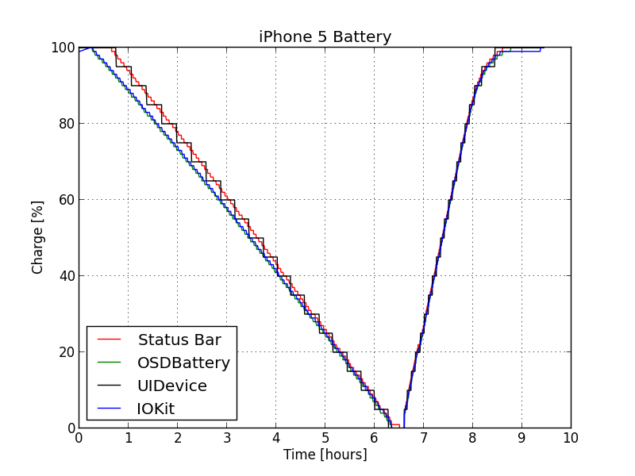
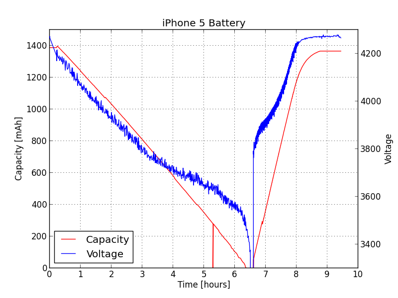

## Drawing iPhone Battery Charge / Discharge

#### Goals

- play with iOS battery related APIs
- find out the best way to measure the battery's charge
- tell if the charge level is linear in time

#### Methodology

I wrote the `BatteryChart` iPhone application. This applications listens to battery data changes notifications and logs the following  data into a CSV file:

    [0] date
    [1] UIStatusBarServerThread StatusBarData -> batteryCapacity
    [2] -[OSDBattery _getBatteryLevel]
    [3] -[UIDevice batteryLevel]
    [4] -[OSDBattery _getBatteryCurrentCapacity]
    [5] -[OSDBattery _getBatteryMaxCapacity]
    [6] -[OSDBattery _getRawBatteryVoltage]
    [7] IOKit IOPSGetPowerSourceDescription CurrentCapacity / MaxCapacity

Note that only `[3]` is a public API.

The log file is appended and saved after each measure, so that even if the device shuts down the measures remain saved. You can retrieve the latest file by sending it to your email address. You can also retrieve all the files through Xcode Organizer.

Battery chart draws the current charge according to the time. More precisely it draws `-[OSDBattery getBatteryCurrentCapacity]` divided by `-[OSDBattery getBatteryMaxCapacity]`.

#### Results

Here is a sample chart:

Data showing a full charge / discharge cycle are available in the `/data/` directory.

#### Observations

###### Charge

- discharge is linerar
- charge is linear until 80%
- after 80% happens "trickle charging":

> Most lithium-ion polymer batteries use a fast charge to charge your device to 80% battery capacity, then switch to **trickle charging**. That’s about two hours of charge time to power an iPod to 80% capacity, then another two hours to fully charge it, if you are not using the iPod while charging. [http://www.apple.com/batteries/](http://www.apple.com/batteries/)

###### Measures

- the public API `-[UIDevice batteryLevel]` is the less accurate, returning the status bar value rounded to 0.5
- all other ways of measuring the battery level return different results, especially when the battery reaches full charge (see charts below)
- `-[OSDBattery _getBatteryCurrentCapacity]` sporadically returns 0
- `-[OSDBattery _getBatteryLevel]` returns the same result as `_getBatteryCurrentCapacity / _getBatteryMaxCapacity`
- `-[OSDBattery _getBatteryLevel]` is very close to IOKit measure

###### Other noticeable APIs

- `[OSDBattery _getBatterySerialNumber]`
- `[OSDBattery _getBatteryCycleCount]`

#### Charts

Here are two charts showing the full discharge / recharge:

